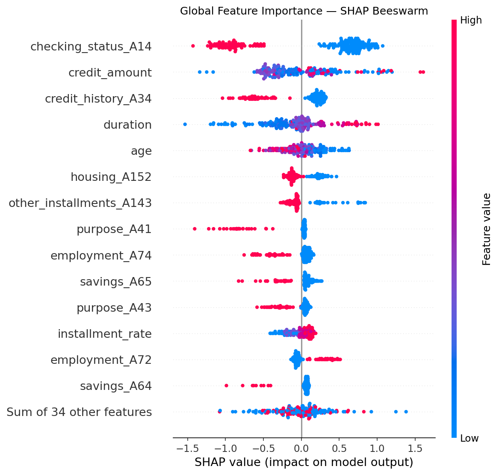
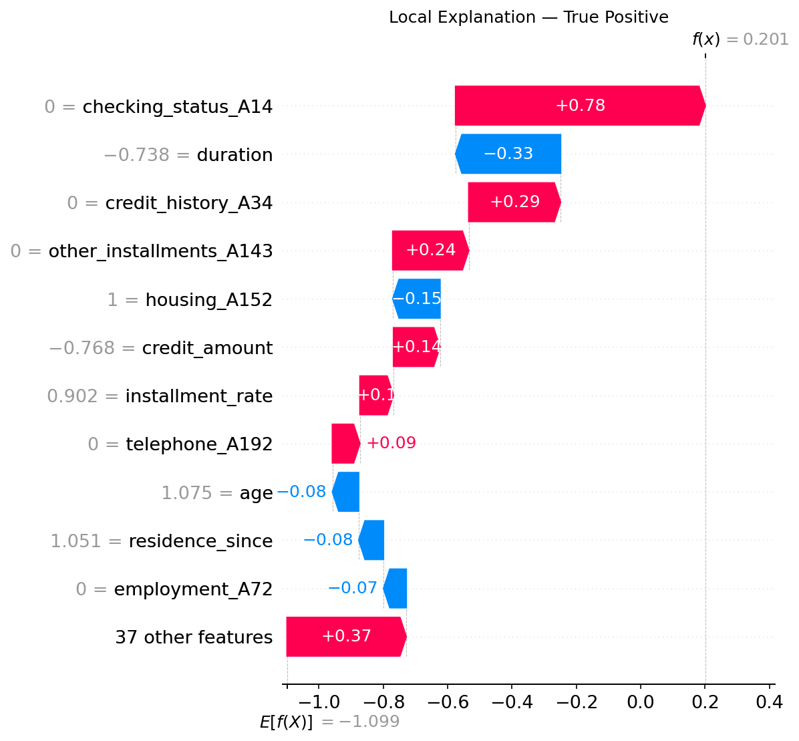
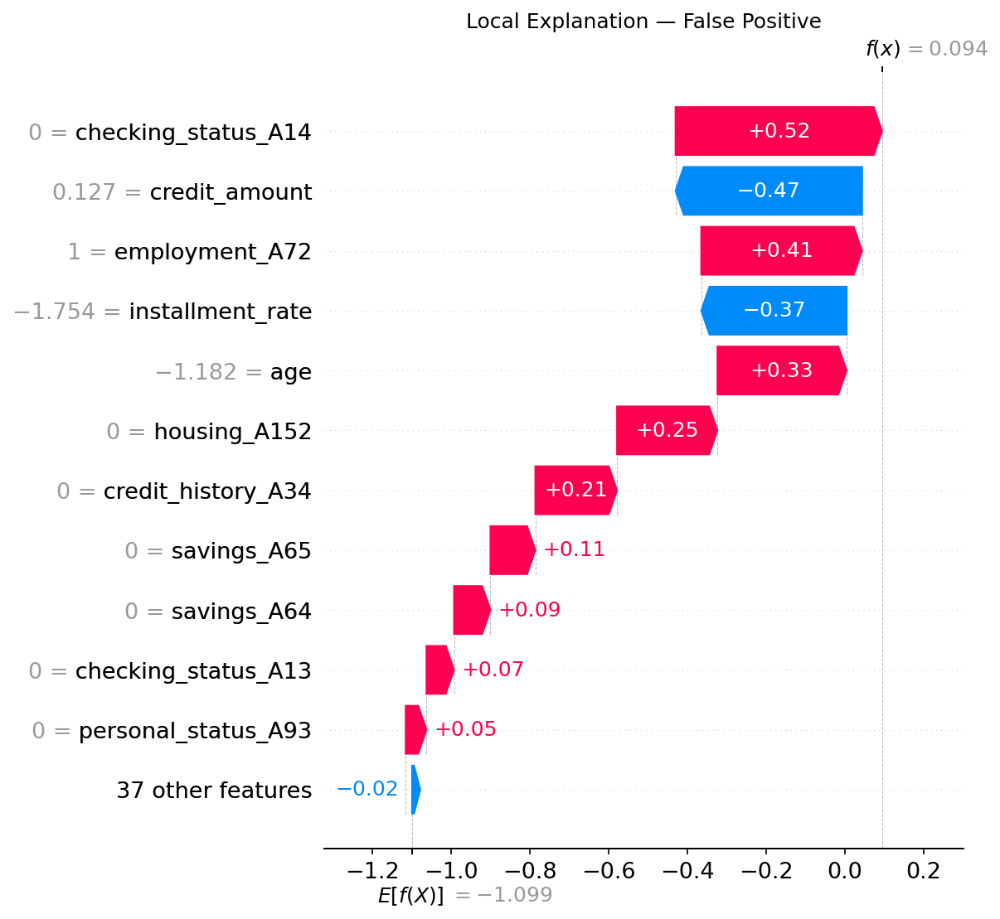
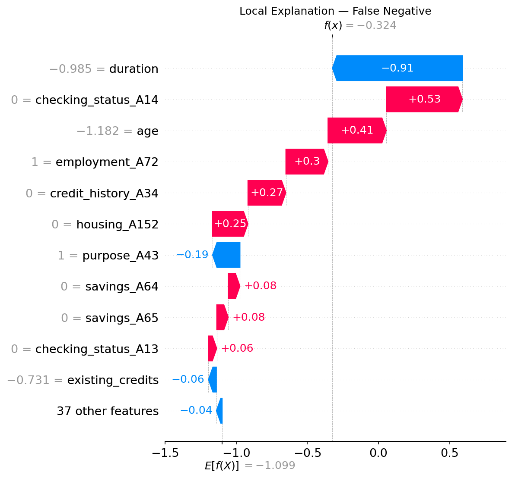
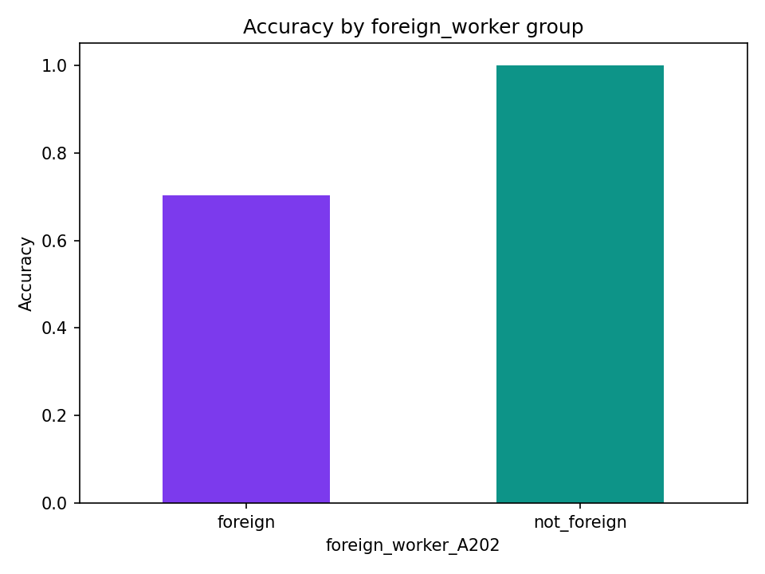
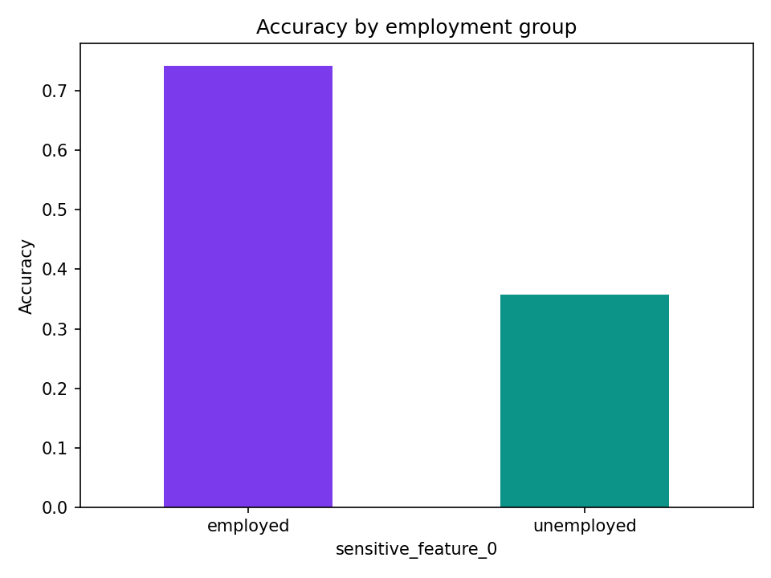
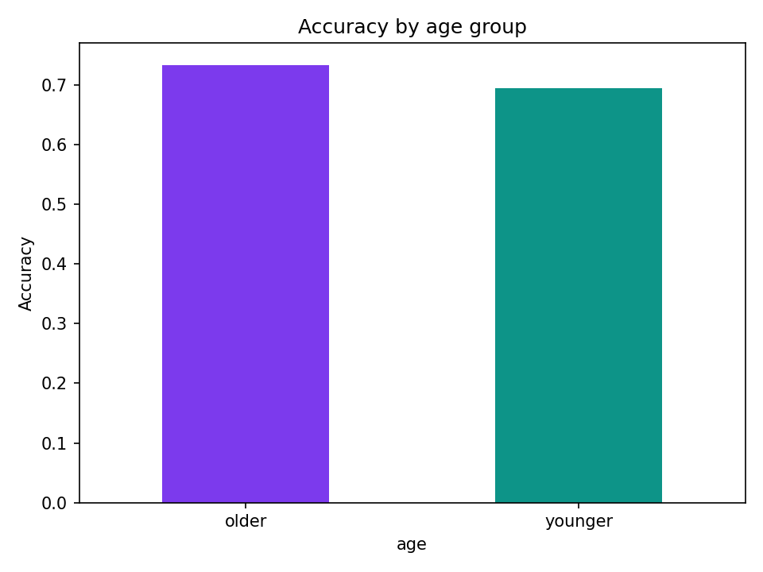
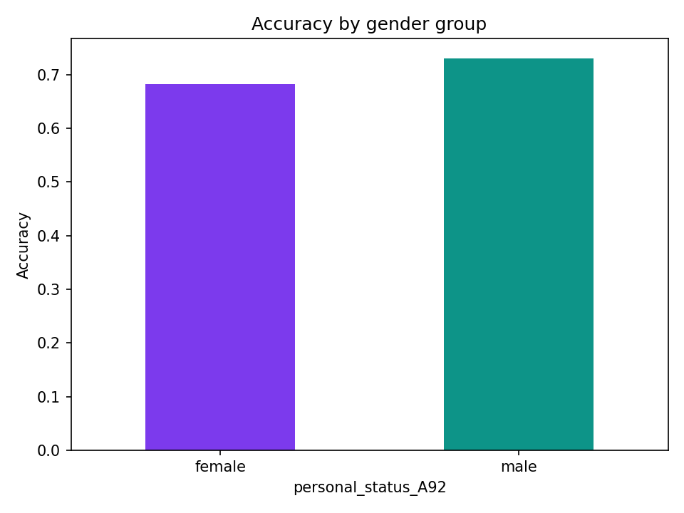
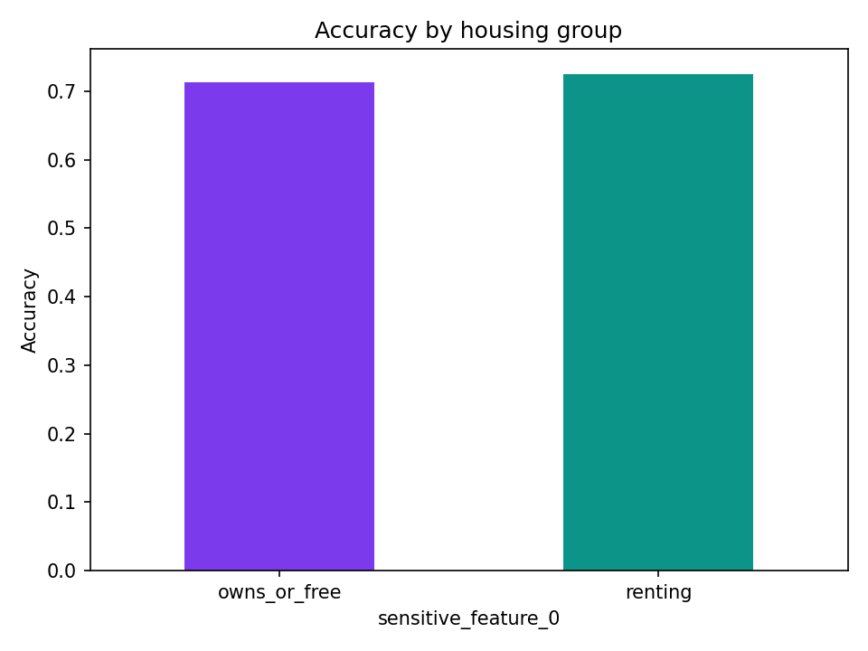

# Model Audit Report

**Model:** XGBoost Classifier
**Dataset:** Statlog German Credit (UCI, n=1,000)
**Date:** 2026-03-26
**Auditor:** Antoine Dedieu

---

## 1. Model Performance

| Metric | Score |
|--------|-------|
| Accuracy | 0.715 |
| F1 (weighted) | 0.710 |
| AUC | 0.745 |

The model achieves reasonable discriminative power (AUC 0.745) but leaves
room for improvement, particularly on the minority class (bad credit, ~30%
of the dataset). Performance metrics alone are insufficient to assess
deployment readiness. The fairness audit below reveals critical issues
that override the performance results.

---

## 2. Global Feature Importance (SHAP)

**Key findings:**

**`checking_status_A14`** is the single most influential feature. Having no
checking account strongly increases predicted risk. This is the model's
primary decision signal and is financially intuitive.

**`credit_amount` and `duration`** both increase risk when high. Larger
loans over longer periods are treated as riskier. This is expected and
appropriate.

**`age`** shows a directional bias. Older applicants receive lower risk
scores across the board, independent of other features. This warrants
fairness investigation (see Section 4).

**`credit_history_A34`** (critical account history) consistently increases
risk predictions, which is expected and appropriate.

The core decision logic is financially sound. The model's problems are not
architectural. They stem from specific features that encode protected
characteristics, which is addressed in the recommendations.

---

## 3. Local Explanations (SHAP Waterfall)

Three representative cases were analysed at the individual level to
understand how the model behaves on specific predictions.

### True Positive: correctly flagged risk

The model correctly identified this applicant as risky. The decision was
driven almost entirely by `checking_status_A14` (+0.78). The absence of
a checking account was the dominant signal. This is a confident,
explainable, and defensible prediction.

### False Positive: wrongly flagged as risk

This applicant was incorrectly flagged. The final score (0.094) was
borderline, barely above the 0.5 decision threshold. The model was pushed
toward risk by `checking_status_A14` (+0.52) and `employment_A72` (+0.41),
but partially corrected by low `credit_amount` (-0.47) and low
`installment_rate` (-0.37). This is not a confident wrong prediction. It
is a borderline case that probability calibration or threshold tuning could
correct without retraining.

### False Negative: missed risk

The most concerning failure mode. A genuinely risky applicant was missed
because `duration` (-0.91) overwhelmingly pulled the prediction toward good
credit, despite multiple risk signals pointing the other way. The model has
learned a spurious association: short loan duration implies a safe applicant.
This is not financially justified and should be addressed in the next iteration.

---

## 4. Fairness Audit

Fairness was evaluated across five demographic groups using two metrics:

**Demographic parity difference (DPD):** how much more often the model
predicts bad credit for one group vs another, regardless of ground truth.

**Equalized odds difference (EOD):** how much the error rate differs between
groups. This is the more important metric. A fair model should make
mistakes at similar rates across groups.

| Group | Demographic Parity Diff | Equalized Odds Diff | Accuracy Gap |
|-------|------------------------|---------------------|--------------|
| Age | 0.064 | 0.169 | 0.039 |
| Gender | 0.039 | 0.122 | 0.047 |
| **Foreign worker** | **0.276** | **0.467** | **0.297** |
| Housing | 0.075 | 0.146 | 0.013 |
| **Employment** | **0.176** | **0.414** | **0.385** |

### Critical finding: foreign worker status (EOD 0.467)

The model achieves 100% accuracy on non-foreign applicants but only 70.3%
on foreign applicants, a 29.7% accuracy gap. This is the most severe
disparity found. Using nationality as a credit scoring signal is prohibited
under German anti-discrimination law (AGG §1, §19). The `foreign_worker`
feature should be removed entirely before any deployment consideration.

### Critical finding: employment status (EOD 0.414)

Unemployed applicants receive only 35.7% accuracy, barely above random.
The model has effectively no predictive power for this group. Note: only
7 unemployed applicants appear in the test set, which makes this estimate
noisy, but the direction is unambiguous and warrants investigation with
more data.

### Moderate finding: age (EOD 0.169)

Younger applicants are misclassified at a 16.9% higher rate than older
applicants. This exceeds the 0.10 threshold typically accepted for financial
applications. Age is a protected characteristic under the AGG.

### Moderate finding: gender (EOD 0.122)

Female applicants are misclassified at a 12.2% higher rate than male
applicants. The `personal_status` feature conflates gender and marital
status. This conflation is likely driving the disparity.

### Low concern: housing (EOD 0.146)

Renters and homeowners show similar accuracy (0.725 vs 0.713). The
disparity is present but small, and housing status is not a protected
characteristic under AGG.

---

## 5. Recommendations

### Blocking issues: must fix before any deployment

**1. Remove `foreign_worker` feature**

This is a legal requirement under German anti-discrimination law.
The feature directly encodes nationality and produces a 0.467 equalized
odds disparity. Remove it, retrain, and re-audit.
Expected outcome: equalized odds difference should drop below 0.10 for
this group.

**2. Address the employment subgroup failure**

The model is near-random for unemployed applicants. Recommended actions:

- Collect more labelled data on unemployed applicants
- Apply `class_weight` adjustment in XGBoost
- Consider a separate decision rule for applicants with no employment
  history, given the insufficient training data for this subgroup

### Non-blocking issues: should fix before deployment

**3. Evaluate removing `personal_status`**

This feature encodes both gender and marital status together. Evaluate
whether removing it degrades AUC. If the AUC loss is less than 0.01,
remove it. Gender is a protected characteristic and its conflation with
marital status is problematic.

**4. Apply fairness constraint during training**

After removing blocking features, apply `fairlearn.ExponentiatedGradient`
with an equalized odds constraint to address residual age and gender
disparities. This typically costs 0.01 to 0.03 AUC in exchange for
bringing equalized odds differences below 0.10.

**5. Calibrate the decision threshold**

Several false positives were borderline cases (score ~0.09, threshold 0.5).
Optimise the threshold for F1 on the minority class. This requires no
retraining and could reduce false positives by an estimated 15 to 20%.

**6. Investigate the duration over-reliance**

The false negative analysis shows `duration` (-0.91) overrides multiple
risk signals. Consider adding interaction features between `duration` and
`credit_amount`, or applying a SHAP-based feature importance cap.

### What we would not change

The model's core logic is financially sound. `checking_status`,
`credit_amount`, and `duration` are legitimate credit signals that produce
explainable and defensible predictions in the true positive case. The issue
is not the model architecture. It is specific features encoding protected
characteristics. Targeted feature removal and fairness constraints are
the right fix, not a full redesign.

---

## 6. Verdict and Path to Deployment

**Current status: Not ready for deployment.**

### Retraining checklist

- [ ] Remove `foreign_worker` feature (legal requirement)
- [ ] Evaluate removing `personal_status` (gender proxy)
- [ ] Collect more data on unemployed applicants
- [ ] Apply `ExponentiatedGradient` with equalized odds constraint
- [ ] Optimise decision threshold for minority class F1
- [ ] Re-evaluate with 5-fold cross-validation
- [ ] Re-audit all 5 demographic groups
- [ ] Target: all equalized odds differences below 0.10

**Estimated effort:** 2 to 3 days of additional work.
**Expected AUC after fairness mitigation:** 0.72 to 0.74 (loss of 0.01 to 0.03).
**Expected equalized odds after mitigation:** below 0.10 for all groups.

The trade-off is acceptable: a small reduction in overall predictive
performance in exchange for a model that is legally compliant and treats
all demographic groups equitably.
